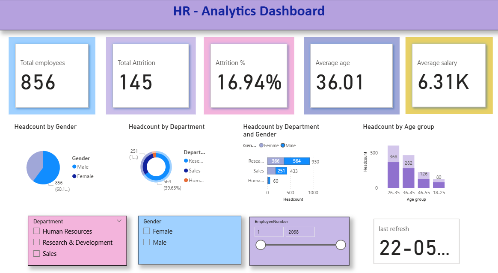

# HR Analytics Dashboard – Power BI

## 📊 Project Overview

This project analyzes employee workforce data using Power BI to generate HR insights and support better decision-making.

## 🛠 Tools Used

* Power BI
* Excel
* Power Query
* Data Visualization

## 📈 Key Features

* Employee attrition analysis
* Department-wise workforce distribution
* Gender and age analysis
* Interactive dashboard with charts and filters

## 🔍 Key Insights

* Analyzed employee distribution across departments
* Identified workforce trends using visual reports
* Generated HR insights for better decision-making

## Dashboard Preview

